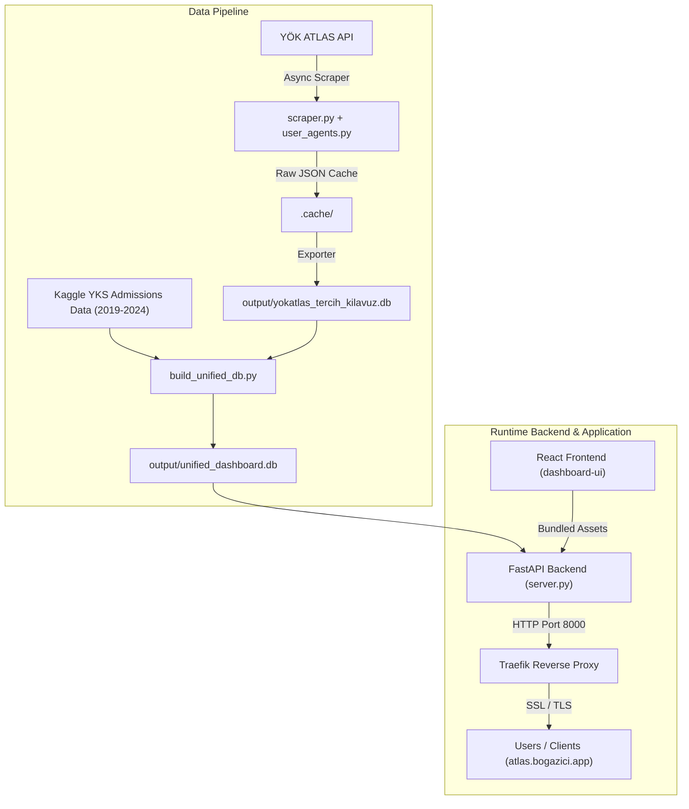

# System Architecture

## Overview Architecture

The UniAtlas system is designed as a modular, lightweight, high-performance web platform. It consists of a data collection pipeline, a unified SQLite storage engine, a Python FastAPI backend server, and a single-page React frontend built with Vite and Tailwind CSS.

---

## Technical Stack & Rationale

| Layer | Technology | Rationale |
| :--- | :--- | :--- |
| **Package Manager** | `uv` (Python 3.12) | Extremely fast C++ written Python package & environment manager. |
| **HTTP Client** | `httpx` + `asyncio` | Asynchronous, concurrent HTTP requests with connection pooling and retry handlers. |
| **Backend API** | `FastAPI` + `Uvicorn` | Modern, high-throughput Python ASGI framework with automatic OpenAPI schemas and low overhead. |
| **Database** | `SQLite3` (Indexed) | Self-contained, zero-configuration relational database capable of handling millions of rows with <5ms indexed queries. |
| **Frontend Framework** | `React` + `Vite` | Ultra-fast HMR dev server and optimized Rollup production bundler. |
| **Styling** | `Tailwind CSS v4` | Utility-first CSS framework with CSS-variable based modern design tokens. |
| **Charts & Icons** | `Recharts` + `Lucide React` | Declarative SVG charting and scalable icon sets. |
| **Containerization** | `Docker` (Multi-stage) | Compact, isolated multi-stage build image combining Node.js frontend compiler and Python 3.12 runtime. |
| **Orchestration** | `Docker Swarm` + `Dokploy` | Production-grade self-hosted deployment with automated SSL certificates via Traefik. |

---

## Component Boundaries

### 1. Data Collection & ETL (`scraper.py`, `user_agents.py`, `exporter.py`)
- Executes out-of-band or on scheduled triggers.
- Communicates directly with external YÖK ATLAS API endpoints.
- Writes raw JSON pages to `.cache/` and outputs standardized tabular data to `output/`.

### 2. Database Integration Layer (`build_unified_db.py`)
- Operates during image creation or app startup.
- Merges the 2026 scraped database with Kaggle historical datasets.
- Creates indexes on frequent query paths (`kilavuzKodu`, `universiteAdi`, `puanTuru`, `basariSirasi`, `ilAdi`).

### 3. Backend API Engine (`server.py`)
- Operates as a stateless ASGI server.
- Connects to `output/unified_dashboard.db` in read-only mode (`Row` factory).
- Serves static assets from `dashboard-ui/dist` for root `/` requests and exposes API routes under `/api/`.

### 4. Client SPA (`dashboard-ui/`)
- Single Page Application compiled into static HTML/JS/CSS assets.
- Calls `/api/*` endpoints relative to the host.
